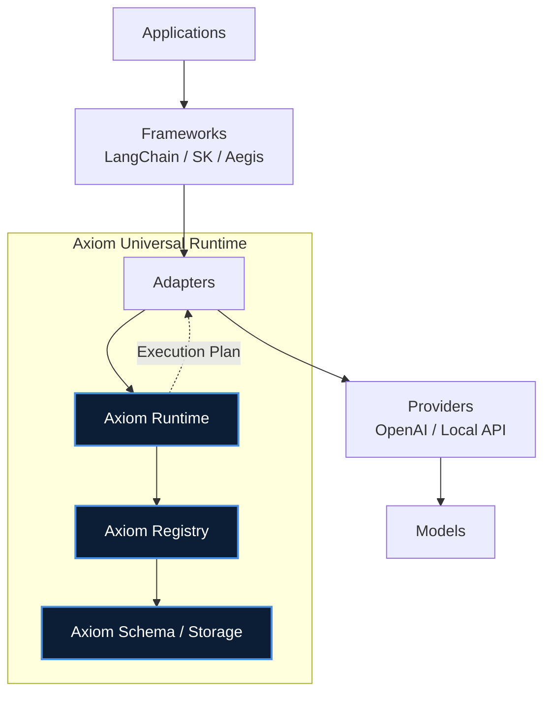
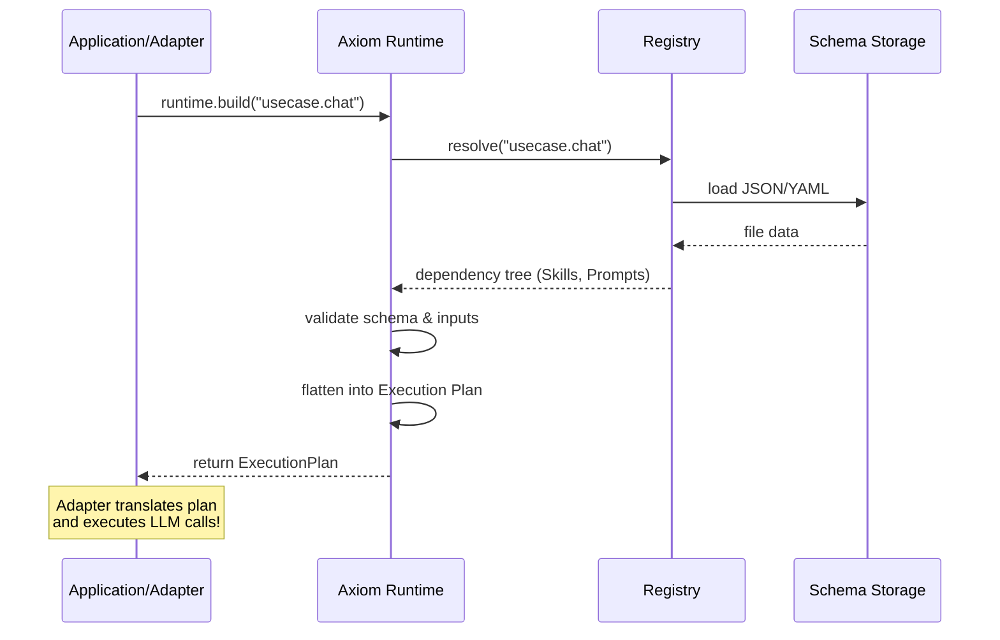

# Axiom

Universal schema-based runtime for prompts, skills, and AI composition. Framework-independent, portable, and enterprise-ready.

Axiom will be the base of implementation, the documentation must be written like a real framework RFC / architecture spec, not notes.
This should become the foundation doc for implementation, so we need:

- clear scope
- clear terminology
- clear architecture
- clear schema definitions
- clear non-goals
- extensibility rules
- enterprise-grade structure

Below is the Base Technical + Strategy + Enterprise Documentation for Axiom v0.1.

For detailed specifications, please refer to the formal documentation in the `docs/` folder:
- [Concept Analysis](docs/concept_analysis.md)
- [Architecture Specification](docs/architecture_spec.md)
- [Schema Definitions](docs/schema_definitions.md)

---

# AXIOM — Universal Prompt & Skill Runtime
## Core Architecture Specification v0.1

## 1. Overview

Axiom is a universal, schema-based runtime for managing, composing, and executing prompts, templates, and skills across different AI frameworks and providers.

Axiom is designed to be:
- framework independent
- provider independent
- portable
- composable
- schema driven
- enterprise ready

Axiom is not a prompt library only.  
Axiom is a runtime + registry + specification for AI prompt/skill composition.

## 2. Goals

### 2.1 Primary Goals
- Define a universal prompt schema
- Support multi-prompt skills
- Support skill composition
- Enable fast search and indexing
- Allow portable storage
- Work with any LLM framework
- Allow adapters for different runtimes
- Support enterprise scale

### 2.2 Secondary Goals
- versioning
- validation
- caching support
- metadata indexing
- plugin support (future)
- workflow support (future)

## 3. Non-Goals (Important)

Axiom is NOT:
- not an agent framework
- not a context engine
- not a provider SDK
- not a UI tool
- not LangChain replacement
- not Semantic Kernel replacement

Axiom is a lower layer:
1. Frameworks
2. Adapters
3. **AXIOM**
4. Providers
5. Models

## 4. Terminology

| Term | Meaning |
|---|---|
| **Template** | reusable structured message blueprint |
| **Prompt** | configured executable instance of a template |
| **Skill** | execution strategy grouping prompts / steps |
| **UseCase** | high-level composition solving an objective |
| **Workflow** | branching execution graph (future) |
| **ExecutionPlan** | the deterministic static graph yielded by runtime |
| **Registry** | indexing, validation, and storage coordinator |
| **Adapter** | translates execution plan to framework runtime |
| **Schema** | typed json/yaml structure definitions |
| **Runtime**| dependency resolver and execution planner |

## 5. Architecture



### 5.1 Layers
- **Layer 1** — Storage
- **Layer 2** — Schema
- **Layer 3** — Registry
- **Layer 4** — Runtime
- **Layer 5** — Adapter
- **Layer 6** — Integration

## 6. Core Concepts

### 6.1 Template
Lowest-level reusable primitive. Defines a structured message blueprint with roles.

**Example:**
```json
{
  "id": "summarize.base",
  "type": "template",
  "inputs": {
    "text": { "type": "string" }
  },
  "messages": [
    { "role": "system", "content": "You are a summarizing assistant." },
    { "role": "user", "content": "Summarize:\n{{text}}" }
  ]
}
```

### 6.2 Prompt
An executable instance derived from a Template. Binds specific parameters or overrides.

**Example:**
```json
{
  "id": "summarize.basic",
  "type": "prompt",
  "extends": "summarize.base",
  "inputs": {
    "text": { "type": "string" }
  },
  "config": {
    "temperature": 0.2
  }
}
```

### 6.3 Skill (Hybrid design)
Skill may contain:
- prompts
- steps
- config
- metadata

**Example:**
```json
{
  "id": "summarize",
  "type": "skill",
  "inputs": {
    "text": { "type": "string" }
  },
  "prompts": [
    "summarize.basic",
    "summarize.short"
  ],
  "strategy": "select"
}
```

**Pipeline skill:**
```json
{
  "id": "rag",
  "type": "skill",
  "steps": [
    "retrieve",
    "rank",
    "compress",
    "answer"
  ]
}
```

### 6.4 UseCase
Composition of skills.
```json
{
  "id": "chat_with_docs",
  "type": "usecase",
  "skills": [
    "rag",
    "summarize"
  ]
}
```

### 6.5 Workflow (future)
Graph execution.
- `skill → skill → skill`
- branch
- loop
- condition

## 7. Schema Design

Schema must be strict and typed for enterprise rigor:
- JSON / YAML compatible
- strictly validated (JSON Schema)
- versioned
- extensible

**Required fields:**
- `id` (must follow strict namespace rules: `namespace.type.name`)
- `type`
- `version`
- `inputs` (Must be typed schema, not flat string arrays)
- `metadata`

**Optional:**
- `config` (Execution params like timeout wrapper, or Model params like temperature)
- `capability` (Tags describing capabilities matching the indexer)
- `messages` (For Templates)
- `extends` (For Prompts inheriting Templates)
- `steps` / `strategy` (For Skills)

## 8. Storage Format

Must be portable.

**Recommended:**
```text
/axiom
   /prompts
   /skills
   /usecases
   /schemas
   /index
```

**Example:**
- `axiom/prompts/summarize.basic.json`
- `axiom/skills/rag.json`
- `axiom/usecases/chat.json`

Must support:
- file system
- git repo
- remote registry
- database (future)

## 9. Registry

Responsibilities:
- load definitions
- index
- search
- validate
- resolve dependencies

**API idea:**
```python
get(id)
find(tag)
find(type)
resolve(skill)
compose(usecase)
```

## 10. Runtime

Runtime does not call model. It prepares and resolves the execution plan.



**Responsibilities:**
- resolve skill
- resolve prompts
- build execution plan
- pass to adapter

`plan = runtime.build("rag")`

## 11. Adapter Layer

Adapters are strictly bridges that receive an explicitly defined `ExecutionPlan` from the Runtime and translate it into a framework-specific execution primitive (e.g., LCEL Runnables).

**Example:**
- Axiom → LangChain
- Axiom → Semantic Kernel
- Axiom → OpenAI
- Axiom → ContextFlow
- Axiom → DSPy

**Adapter API Contract:**
```python
plan = runtime.build("usecase.chat")

adapter.ingest(plan)
runnable = adapter.to_chain()
result = runnable.invoke({"text": "example"})
```

## 12. Search & Index

**Required:**
- by id
- by tag
- by type
- by input
- by capability

**Future:**
- semantic search
- embedding index

## 13. Versioning

Each object must support:
- `id`
- `version`

**Example:**
- `summarize.basic@1.0`
- `summarize.basic@1.1`

Registry must resolve latest.

## 14. Validation

Schema validation required.

Before runtime:
- validate prompt
- validate skill
- validate usecase

Errors must be strict. Enterprise rule.

## 15. Extensibility Rules

**Allowed:**
- new types
- new metadata
- new adapters
- new storage
- new strategies

**Not allowed:**
- breaking schema
- changing id format
- changing type rules

## 16. Enterprise Requirements
- deterministic loading
- strict schema
- version locking
- dependency resolution
- offline support
- auditability
- reproducibility

## 17. Implementation Scope v0.1

**Must implement:**
- schema
- prompt
- skill
- usecase
- registry
- runtime
- file storage
- search
- validation

**Not yet:**
- workflow graph
- plugins
- semantic search
- UI
- agent system

## 18. Relation to Other Systems

| System | Relation |
|---|---|
| **ContextFlow** | execution pipeline |
| **Aegis** | context engine |
| **LangChain** | adapter target |
| **Semantic Kernel**| adapter target |
| **DSPy** | adapter target |
| **OpenAI API** | adapter target |

Axiom must stay independent.

## 19. Design Principles
- Schema first
- Portable always
- Framework neutral
- Composable
- Deterministic
- Minimal core
- Extensible outside core

## 20. Next Step After This Doc

Implementation order should be:
1. schema
2. prompt model
3. skill model
4. usecase model
5. registry
6. loader
7. runtime
8. adapter interface
9. search
10. validation

This document is sufficient to start implementation.