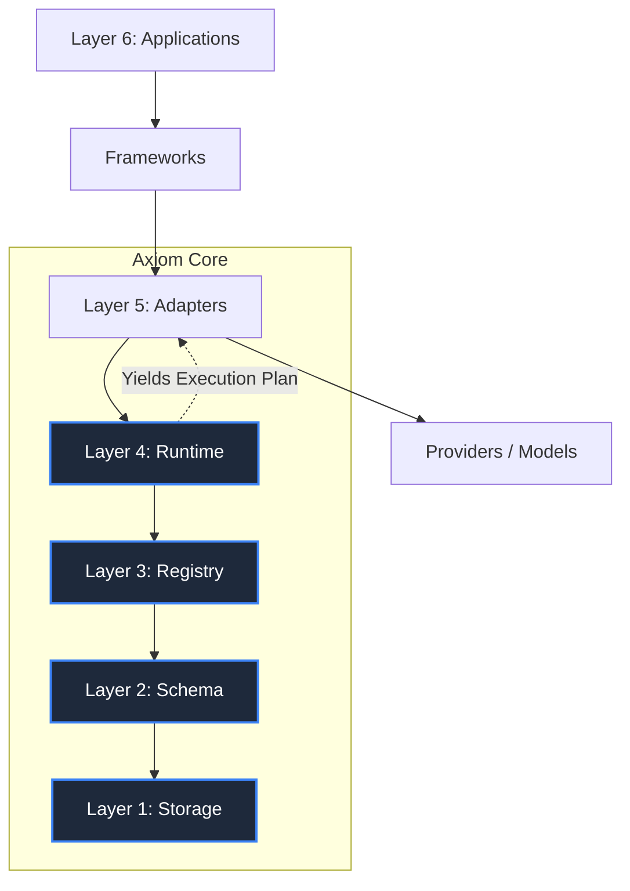

# Axiom Architecture Specification (RFC)

## 1. Introduction
Axiom is a universal, schema-based runtime designed to manage, compose, and execute prompts, templates, and skills across disparate AI frameworks and model providers. It provides a generalized specification for AI skill composition, abstracting away the specific execution environments (such as LangChain, Semantic Kernel, or raw API calls).

## 2. System Architecture
Axiom operates as a foundational layer underneath enterprise applications and AI frameworks. It consists of six distinct layers:

1. **Layer 1: Storage** - Portable storage format (File System, Git, Database) for schemas.
2. **Layer 2: Schema** - JSON/YAML definitions specifying inputs, metadata, and structural composition.
3. **Layer 3: Registry** - The indexing, resolution, and validation engine. Loads items from storage into memory.
4. **Layer 4: Runtime** - An execution planner. It parses use-cases and skills, resolves dependencies, and builds an execution plan. **Crucially, the Runtime does NOT execute LLM calls.**
5. **Layer 5: Adapter** - Integration bridges that ingest the strictly typed `ExecutionPlan` JSON and compile the static nodes/edges into actual framework-specific interactive runnables (e.g., LangChain chains, ContextFlow pipelines).
6. **Layer 6: Integration/Applications** - The top-level application utilizing the adapters.

## 3. Core Terminology & Hierarchy
- **Template:** The lowest-level reusable primitive, defining a structured message array with distinct roles (system, user, tool).
- **Prompt:** An executable instance derived from a Template, binding specific inputs, parameters, and configs.
- **Skill:** A logical grouping of prompts/steps, dictating execution semantics (e.g., pipeline, select).
- **UseCase:** A high-level composition of multiple Skills designed to solve a business problem.
- **ExecutionPlan:** The deterministic static graph generated by the Runtime Engine.

## 4. The Registry
The Registry is the heart of Axiom's state management. 
- **Responsibilities:** 
  - Recursively discover and load `.json`/`.yml` schema definitions from the Storage Layer.
  - Index definitions by `id`, `tag`, `type`, and `capability`.
  - Perform strict schema validation against the registered definitions.
  - Resolve dependency chains (e.g., loading a Skill dynamically resolves its underlying Prompts).

## 5. The Runtime Engine
The Runtime acts as the planner and dependency resolver.
- Takes an entry point (e.g., `runtime.build("usecase.chat_with_docs")`).
- Retrieves the UseCase from the Registry.
- Flattens the dependency tree, ensuring all required Skills and Prompts are available and valid.
- Evaluates `config` (like timeouts and retries) and strictly typed `inputs`.
- Outputs a deterministic **Execution Plan** JSON structure containing nodes, edges, resolved variables, and configurations.

## 6. Enterprise Requirements & Extensions
To operate in enterprise environments, Axiom enforces:
- **Strict Validations:** Errors must fail hard during the loading phase, preventing runtime crashes.
- **Version Locking:** Every entity must support versioning (e.g., `prompt_name@1.2.0`). The Registry resolves the latest version unless explicitly locked.
- **Immutability & Auditability:** Schema files stored in Git provide a natural audit log of prompt modifications, easily trackable via standard diffs.

## 7. Non-Goals
To prevent feature bloat, Axiom explicitly avoids:
- Being an agentic framework capable of autonomous tool-use routing.
- Managing chat memory or history management (Contextual routing).
- Serving as a direct provider SDK or wrapper.
